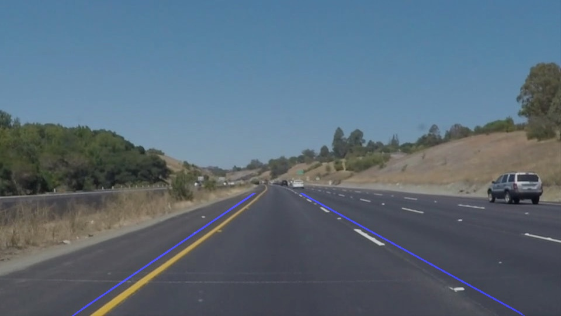

# **Lane Lines P1**

P1.ipynb is a python code that could identify the lane in the source images or the source videos.

## Installation

**Step 1:** Set up the [CarND Term1 Starter Kit](https://github.com/udacity/CarND-Term1-Starter-Kit/blob/master/README.md).

**Step 2:** Open the code in a Jupyter Notebook

`> jupyter notebook`

## Known Bugs
* The predicted lane line might not the be center of the lane line in the image. In the video, the lane line would show up 45 deg offset from the image in some frame.
* The image color shown in the notebook & the output file might not match. Known bugs as for OpenCV default color format is BGR.
